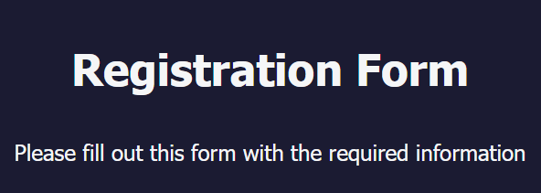

# Registration Form

An implementation of a registration form from [FreeCodeCamp](https://www.freecodecamp.org/learn/2022/responsive-web-design/learn-html-forms-by-building-a-registration-form/step-1)

A snapshot of the program: 



## Description

This project is used to practice front-end and back-end development. Gathering information from the user in the form from a user is essential for almost every web application. Storing the information in a database is essential.

For practicing of both SQL and NoSQL databases, this project uses a local MySQL database and local Mongodb NoSQL database to store information. The design choice is justified because the MySQL stores data essential to the user login information (first name, last name, email, password, etc.), while the Mongodb NoSQL database stores information optional to the user (age, referral, bio, etc.).

### Implemented Technologies

Implentation of form built with the following technologies:

* :snake: Python/Flask/Pipenv
* :writing_hand: Git
* :writing_hand: HTML5/CSS3
* :cloud: MySQL
* :cloud: Mongodb

### Implemented Python Modules

This project also used the following Python modules:

* [dotenv](https://pypi.org/project/python-dotenv/)
* [hashlib](https://pypi.org/project/hashlib/)
* [mysql.connector](https://pypi.org/project/mysql-connector-python/)
* [pymongo](https://pypi.org/project/pymongo/)
* [flask-wtf](https://pypi.org/project/Flask-WTF/)

### Utilizing and Using an Enviroment (.env) file

This project uses .env to record secrets: MySQL username, password, secretkey to not commit this important information to github

See the following pattern:

```
import os 
 
# obtain sensitive information using os module in .env file from pipenv shell
user_ = os.environ.get("USER") 
pass_ = os.environ.get("PASSWORD")

# use user_ and pass_ in code
```

The .env file it listed in .gitignore and should never be uploaded to github or committed locally in git because it contains sensitive data

This project uses [pipenv](https://pipenv.pypa.io/en/latest/) globally to install Python modules, load .env file, and start the flask server

### Installing and Using Pipenv

To install pipenv, see [here](https://pipenv.pypa.io/en/latest/install/)

Once installed, cd to the directory(assuming directory name is registrationFormMySQL)

```
cd registrationFormMySQL
```

Then run the following command to install 3rd party dependencies in pipenv:

```
pipenv install
```

To run code in an isolated pipenv enviroment, execute the following command
**(This starts the enviroment using Flask development server)**:

```
pipenv app.py
```


### Installing and Using MySQL Database

To install [MySQL](https://www.mysql.com/) database, use the community edition download:

* [Community Edition Download](https://dev.mysql.com/downloads/)
* Install the following : MySQL Server, MySQL Shell, MySQL Workbench

After installing MySQL Community Edition, launch MySQL shell:

* If first time launched, set password for root user
* If no database created, using the following command to create a database (we assume the name of database is registration):
  
  ```
  CREATE DATABASE registration;
  ```
* Select the database 'registration' using the following command:

  ```
  USE  registration;
  ```
* Create the table using the following command to create a table (we assume the name of the table is persons):

  ```
  CREATE TABLE persons (
      personID int NOT NULL AUTO_INCREMENT, firstName varchar(255) NOT NULL, 
      lastName varchar(255) NOT NULL, email varchar(255) NOT NULL, 
      password varchar(255) NOT NULL, account varchar(255) NOT NULL, 
      UNIQUE (email), PRIMARY KEY (personID)
  );
  ```
  
* We recommend to create a new user, as alternative to root, if so follow instructors to [create new user in MySQL](https://hackr.io/blog/how-to-make-a-new-user-in-MySQL)

### Setting up Enviroment (.env) File
* This sets up the MySQL server, now edit the .env file:

  ```
  USER='[insert name of user]'
  PASSWORD='[insert password of user]'
  SECRETKEY='[insert any random string for Flask app]'
  ```

### Installing and Using Mongodb Database

## Getting Started

### Dependencies

* Requires Java Development Kit, JDK

### Installing

* To install the ava Development JDK, [JDK](https://docs.oracle.com/en/java/javase/17/install/overview-jdk-installation.html#GUID-8677A77F-231A-40F7-98B9-1FD0B48C346A)

### Executing program

The easiest method is the following:
* Install Eclipse, or equivalent Java IDE
* Import folders in this repo as new Java Projects
* Select a project and run in Java IDE

## License

This project is licensed under the GNU General Public License v3.0 [License](License.md) - see the LICENSE.md file for details

## Authors

* :ocean: **Normandy14** - *Initial work* - [Github Account](https://github.com/Normandy14)
